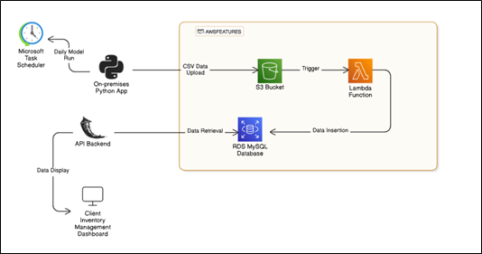

#  **Sales Forecasting With ML Model(XGBoost Regressor)**

This project is a lightweight prototype of an Inventory Management System Dashboard. It integrates a machine learning model for forecasting sales and visualizes the predictions in a simple, frontend dashboard.

The repository contains the frontend dashboard code and the Flask API backend used to fetch prediction stored in an AWS cloud database. The system uses a serverless architecture by leveraging AWS Services (Lambda, API Gateway, S3, and RDS) allowing prediction data to be queried without the need to manage a backend server.

##  System Architecture:

##  Here's how the systm fits together:
1. Predictive Model runs on a local device and generates CSV prediction files
2. CSVs are uploaded to an AWS S3 bucket (acting as a staging area)
3. Upload to S3 trggers a Lambda function to insert predictions into AWS RDS NoSql database.
4. Flask API (hosted on AWS Lambda via API Gateway) retrieves prediction data.
5. Frontend Dashboard uses this API to fetch and present data to users.

